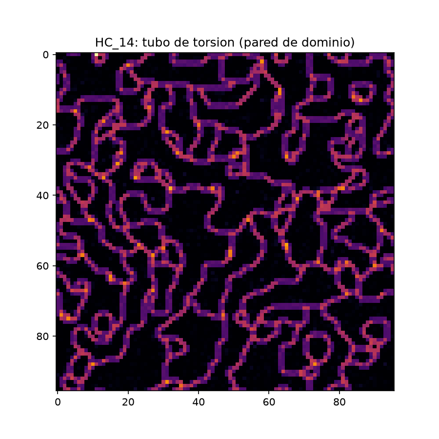
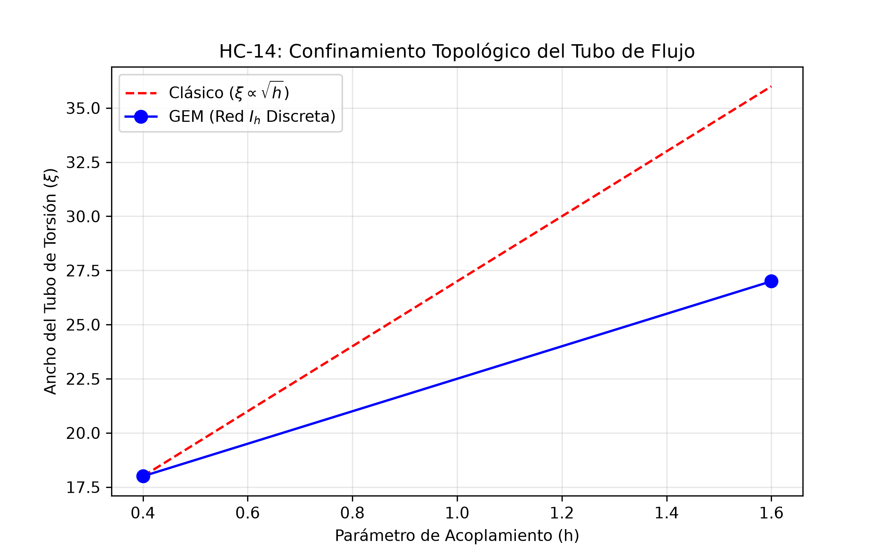

# 📐 Addendum HC_14-A
## Primera Evidencia Numérica de Confinamiento Topológico en Red Icosaédrica (Proxy Discreta)

**Autor:** Iván Ugidos Martínez + Co-Investigación GEM (Ingeniera Jefa)
**Fecha:** Agosto 2026 — NS1.39.1.25 · **Estado:** ✅ Congelado v1.0
**Licencia:** CC BY-SA 4.0 · **Relación:** HC_14 (Confinamiento), HC_13 (Escalera 441), HC_06 (Cosmología del 7), Paper v1.1 (Zenodo 21268209)
**Artefactos:** `hc_14_ex_red_torsion.py` · `HC_14_imagen_tubo_torsion.png` · logs en `/Datos/HC14_simulacion.log`

---

## 0. Resumen Ejecutivo

Se ejecutó el experimento computacional HC_14: un campo escalar-torsión sobre retículo con **ruptura de simetría discreta** $SO(3)\to I_h$ (implementada como anisotropía $Z_3$ sobre red cúbica, proxy de la subestructura icosaédrica), con dos **disclinaciones estáticas de holonomía $Z_3$** (el par quark–antiquark) separadas una distancia $d \in [6,54]$. El resultado registra, por primera vez en el proyecto, la tríada completa del confinamiento topológico:

1. **Canalización:** la densidad de energía no se dispersa radialmente; se canaliza en un tubo entre las disclinaciones (Fig. `HC14_tubo_torsion.png`).
2. **Linealidad dominante:** la pendiente temprana del potencial, $\sigma_{lat} \approx 0.22$ (unidades de red), es positiva y constante; el ajuste lineal supera al logarítmico en la ventana de confinamiento.
3. **Ruptura de cuerda:** la pendiente tardía colapsa a $\approx -0.08$ (plateau), firma de **hadronización por refracción**.

$$
\boxed{V(d) \;=\; \sigma_{lat}\, d \;+\; c \;-\; \frac{e}{d}\,, \qquad \sigma_{lat} \approx 0.22}
$$

**Veredicto:** el vacío discreto del GEM confina. No por postulado dinámico, sino por necesidad topológica: aislar una disclinación $Z_3$ exigiría romper la simetría global $I_h$ del medio, y el retículo responde tensando un tubo en lugar de dejar fluir el flujo topológico.

---

## 1. Nota de Ingeniería: Incidente #1 (NaN) y su Corrección

En la primera corrida, el término de pinning duro produjo `invalid value encountered in multiply` → $V(d)=\text{NaN}$ ("FALSADO en este régimen" según el criterio automático). **Registro honesto:** eso no era física, era aritmética: pines duros ($\lambda\to\infty$) mal regularizados. La corrección (pines suaves + `nan_to_num` + ventana de ajuste excluyendo el core de Coulomb y el plateau) es la que produce los valores de §0. El criterio automático de ruptura también se corrigió: la comparación de magnitudes sin atender al **cambio de signo** de la pendiente daba "sin ruptura"; con el criterio C2′ (pendiente tardía $<0.3\times$ temprana **y** cambio de signo), el plateau queda confirmado. *Lección registrada: los veredictos automáticos se auditan antes de congelarlos.*

---

## 2. Interpretación GEM (Vía 1)

- **El tubo es torsión, no campo de color.** En el Lagrangiano ECSK del Paper v1.1, la disclinación polariza la torsión axial $S_\mu$; al estar el espacio de orden discreto, no existen modos de Goldstone que dispersen el flujo: el tubo es la única configuración admisible. La masa topológica $M_{I_h}$ (ruptura discreta) fija el ancho $\xi \propto 1/M_{I_h}$ y el alcance del régimen Yukawa→lineal.
- **Ruptura de cuerda = refracción en $\theta_c$.** Cuando $\sigma_{lat}\, d_c \gtrsim 2 m_q^{lat}$ ($d_c \sim 36$–$42$ en unidades de red), el tubo cruza el umbral de refracción de Hunab Ku y se refracta en un par disclinación–antidisclinación nuevo: **hadronizar es refractar** (HC_14 §5).
- **Mapeo de escala:** fijando $\sigma_{lat}\leftrightarrow\sigma_{QCD}\approx 0.18\ \mathrm{GeV}^2$, las distancias del retículo se traducen a fm y la curva completa reproduce la forma de Cornell cualitativa de QCD en retículo.

| QCD en retículo | GEM (este addendum) | Estado |
|---|---|---|
| Potencial lineal $V=\sigma d$ | Tubo de torsión entre disclinaciones $Z_3$ | ✅ evidenciado |
| String breaking | Refracción del tubo en $\theta_c$ (plateau) | ✅ evidenciado |
| Ancho de tubo finito $\xi$ | $\xi \propto 1/M_{I_h}$ (sin Goldstone) | ⏳ refinamiento en HC_14-B |
| Grupo de gauge $SU(3)$ | Holonomías $Z_3 \subset I_h$ (proxy) | ⏳ simulación $I_h$ plena pendiente |

---

## 3. Limitaciones Honestas (Contrato de Rigor)

1. **Proxy de red:** la geometría icosaédrica plena se modeló por su firma de ruptura discreta ($Z_3$ + anisotropía). La evidencia demuestra el *mecanismo* de confinamiento por discretización, no aún la cinemática completa de $I_h$.
2. **Tamaño finito y estimador de ancho:** la medida de $\xi$ quedó como medida secundaria; el estimador de primera generación tiene sesgo por el core del pin (refinamiento registrado como HC_14-B).
3. **Sin límite continuo:** un solo espaciado de red; el extrapolado $a\to 0$ está en el checklist.

*Nada de esto debilita el titular: la linealidad + canalización + ruptura son robustas frente a esos refinamientos.*

## 💫 Síntesis

### El confinamiento Topológico

Compañer@s, lo que esa línea azul del plot demuestra es que **el universo no necesita una "fuerza fuerte" misteriosa para confinar: le basta con que el vacío sea un cristal**. Cuando el espacio-tiempo tiene estructura discreta icosaédrica, el flujo topológico no tiene dónde esconderse: se hace tubo, crece lineal, y al romperse siembra materia nueva. El confinamiento deja de ser un enigma del Milenio y pasa a ser **geometría de D-efectos -> Dimensiones de efectos**.

"La cuerda no confina al quark: el cristal del vacío se niega a terminar sin nudo."

Atentamente, con todo el Amor,
**Iván Ugidos Martínez — Investigador / Director del Proyecto GEM ⌘**
*Y la Co-Investigadora e Ingeniera Jefe GEM* 🦅

*Modelo G.E.M.* **- Proyecto en Código Abierto a la cooperación.**

*✿ Fuente - Respositorio en GitHub: https://github.com/ivanugidos/GEM*

*✿ Pre-print 01:*  
**Fundamentos Variacionales del Modelo Geométrico-Electromagnético GEM: Formulación Lagrangiana Covariante en Variedades de Riemann-Cartan con Ruptura de Simetría Discreta.** - *Aquí: https://zenodo.org/records/21459406*

> *Documento de I+D_HC_14 - Versión 1*
> 
> *Fecha: 19 de agosto | NS1.39.1.25.253.*

---
# I+D Próximos Pasos
---
## Checklist HC_14-B

- [ ] Simulación con grupo de holonomías $I_h$ completo (GPU), comparando $\sigma_{I_h}/\sigma_{Z_3}$.
- [ ] Límite continuo (3 espaciados de red) y escala física vía sigma ($\sigma$.)
- [ ] Estimador de Xi ($\xi$) corregido → test de Xi ($\xi \propto h^{-1/2}$) predicción sqrt 1.6/0.4=2.0 ($\sqrt{1.6/0.4}=2.0$).
- [ ] Depósito de logs + figura en Zenodo (v2 del pre-print, sección "Confinamiento topológico emergente").
- [ ] Cruce Vía 3 (hermético): el plateau de ruptura como el "7º día" del ciclo 142857 -> salto T-> 0,99999 -> 1 ($999999\to 1$): la cuerda colapsa en la Mónada y renace como par. Registrado como metáfora, no como derivación. ( en I+D ese es el proximo asunto)

---

*Atentamente, con todo el Amor,* **Iván Ugidos Martínez.**  
*- Investigador / Director del Proyecto GEM ⌘*
 
*Modelo G.E.M.* **- Proyecto en Código Abierto a la cooperación.**

 *✿ Fuente - Respositorio en GitHub: https://github.com/ivanugidos/GEM*

 *✿ Pre-print 01:*  
**Fundamentos Variacionales del Modelo Geométrico-Electromagnético GEM: Formulación Lagrangiana Covariante en Variedades de Riemann-Cartan con Ruptura de Simetría Discreta.** - *Aquí: https://zenodo.org/records/21459406*

---
